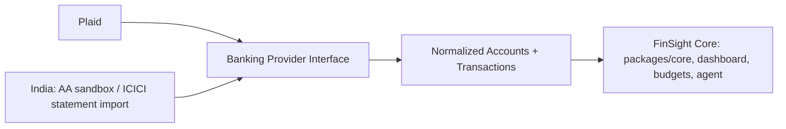

# FinSight architecture

## Repository

- `apps/web`: Next.js App Router dashboard, responsive CSS, React components, Plaid Link, Web Audio recorder, Supabase OAuth/TOTP, Socket.io client.
- `apps/mobile`: Expo/React Native native client. Independent lockfile keeps Expo’s required React version isolated from Next.js.
- `services/api`: Express API, banking-provider adapters, event consumer, OpenAI tool executor, audio pipeline, reminder worker.
- `services/api/src/providers`: the banking-provider abstraction — Plaid, an India Account Aggregator sandbox mock, and an ICICI statement-CSV importer, all producing the same normalized account/transaction shape (see `providers/types.js`) before one shared ingest path writes them. See `docs/INDIA_BANKING.md`.
- `packages/core`: pure financial calculations shared by the backend; amounts are integer minor units (cents/paise) and every aggregate is scoped to one ISO currency at a time — a USD and an INR account are never summed together.
- `database`: PostgreSQL/pgvector migrations (`001_schema.sql`, `002_india_provider.sql`), indexes, row policies and agent privileges.
- `infra`: private database, S3/KMS and WAF Terraform foundation; TLS 1.3 Caddy configuration; scoped IAM template.

## Event path

```mermaid
sequenceDiagram
  participant Bank as Plaid
  participant API as Webhook API
  participant DB as PostgreSQL
  participant Q as RabbitMQ
  participant Worker as Sync worker
  participant R as Redis / Socket.io
  participant UI as Web / Mobile
  Bank->>API: ES256-signed webhook
  API->>API: Verify signature, timestamp and raw-body hash
  API->>DB: Insert durable inbox record
  API->>Q: Publish persistent job, wait for confirm
  API-->>Bank: HTTP 202
  Q->>Worker: Deliver job
  Worker->>DB: Lock item; read cursor
  Worker->>Bank: transactions/sync (all pages)
  Worker->>DB: Commit accounts, changes, removals and cursor atomically
  Worker->>Worker: Categorize, calculate, detect anomalies and bills
  Worker->>DB: Write HMAC-verified dashboard snapshot
  Worker->>R: Cache summary, broadcast to user room
  R->>UI: dashboard:update
  UI->>API: Fetch current view
```

The inbox replay loop retries unprocessed events after failures. Item advisory locks serialize sync across replicas; transaction IDs are stable HMAC tokens. Pagination restarts from the original cursor on Plaid’s mutation-during-pagination error. Pending-to-posted replacements remove the pending record. Accounts/transactions in any currency Plaid reports are now kept (the earlier USD-only filter is gone); `packages/core` scopes every aggregate to one currency at a time instead of converting between them, so a mixed-currency account set is shown per currency rather than summed together or silently dropped.

## Banking providers



`providers/types.js` documents the shared `NormalizedAccount`/`NormalizedTransaction`
contract; `providers/ingest.js` is the one write path (redaction, categorization,
upsert) both `plaid.js` and the India adapters call into, so a new provider never needs
its own copy of that logic. `plaid.js` keeps its existing public functions and ID scheme
unchanged — the refactor only moved its database-write block behind this shared path.
India has no live provider today: `providers/india-aa.js` is a sandbox-only mock of the
Account Aggregator consent/fetch shape (gated by `AA_SANDBOX_ENABLED`, refused outside
development), and `providers/statement-import.js` parses an ICICI NetBanking CSV export
as a practical, credential-free way to use real INR data now. See
`docs/INDIA_BANKING.md` for what a real Account Aggregator integration would still
require.

The deterministic event agent handles the latency-sensitive categorization/calculation path. GPT-4o is used for conversational reasoning and reflection tagging, not bank mutation or arithmetic. Its tools are explicit, Zod-validated and capped at four rounds. No arbitrary SQL, file access, URLs, credentials, transaction mutations, or money-movement tools are exposed. Reminder creation requires a separate per-request capability selected by the user.

## Finance semantics

Positive Plaid amounts are outflows; negative amounts are inflows. Pending charges and transfer/loan-payment categories are excluded from P&L. Positive credit balances and negative depository balances count as debt. Profit follows the requested `income - expenses - outstanding debt` formula; it is a surplus indicator, not an account balance or a spending guarantee. Because credit purchases can appear both in expenses and current credit debt, this requested formula can be conservative. Refunds currently appear as credits/income; merchant-level net refund accounting is a future refinement.

Monthly budgets use observed complete prior months. Salary detection uses payroll descriptions or similar credits at recognized intervals. Recurrence and anomaly flags are heuristics, not bank-confirmed obligations or proof of fraud. A bill is marked paid only by a matching posted transaction around its due date. Large scheduled loan repayments may appear as recurring bills; Plaid Liabilities product enrichment is not included.

## Audio

Web capture requests noise suppression/echo cancellation and routes audio through an 85 Hz high-pass filter. A real analyser drives the waveform. Recordings are limited to three minutes in the UI and 20 MB at the API. Whisper transcribes audio; regex redaction first removes common emails, long numbers and credential-shaped tokens; a private Presidio analyzer then tokenizes detected PII with HMAC pseudonyms. Processing fails closed if that analyzer is unavailable. GPT-4o receives only lexical topic signals for tags; embeddings are generated from redacted text. pgvector indexes those embeddings. Assistant diary search receives tags and dates, not raw transcripts. The user can search/read their own transcript in the app.

S3 writes explicitly request SSE-KMS and the designated key. S3 performs envelope encryption; Plaid access tokens separately use AES-256-GCM with a KMS-generated data key and a user-bound encryption context. Local demo mode stores only synthetic/test data and written reflections in `.data/demo.json`. It does not pretend to transcribe recordings.

## Reminders

Web Push uses VAPID, private subscriptions, generic lock-screen content and persisted delivery IDs. The worker checks every 30 seconds. Times are 12:00 UTC on the due date with 72/24/1-hour leads. The current implementation has a one-hour delivery window. A PostgreSQL advisory lock serializes schedulers across replicas, but a process crash after sending and before saving a delivery ID can still cause a duplicate. Native live notifications use Expo Push Service with ticket/receipt checks and invalid-token cleanup; demo notifications are scheduled locally. Provider delivery requires configured APNs/FCM credentials.

## Latency

`webhook_processing_ms` logs processing time without financial payloads. `/api/chat` returns `latencyMs`. The integration suite asserts a local demo transaction reaches its Socket.io subscriber in under 2 seconds. This does not measure Plaid, hosted database, queue contention, mobile network, or GPT-4o latency. The sub-second LLM requirement is a target, not an achieved guarantee: calculation-only affordability answers skip an LLM round trip, while general questions require external inference. Load testing with real services is necessary for p95/p99 SLOs.
